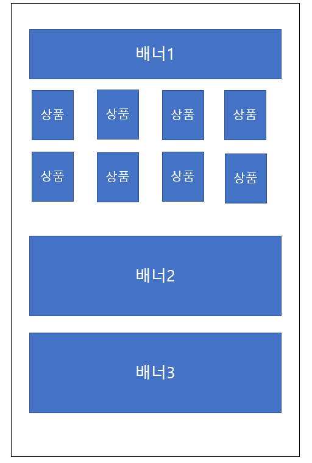

# 이벤트 전시

이벤트 페이지들의 전시 구좌가 공통된 컴포넌트의 반복임을 파악하여 전시구좌를 컴포넌트화한 프로젝트입니다.

 
예를 들어 위와같은 이벤트가 전시되어있을 때  
배너1과 상품들을 전시구좌1,  
배너2,3을 전시구좌2라고 하면  

전시구좌1은 또다시 배너1, 상품들로 쪼갤 수 있고, 
전시구좌2는 배너2, 배너3으로 쪼갤 수 있습니다. 

이런 컴포넌트들의 front 화면을 미리 만들어 놓고 컴포넌트의 타입에 따라 해당 뷰를 가져와 컴포넌트를 합치면 하나의 이벤트 페이지를 제작할 수 있습니다.

 

# 컴포넌트 타입

컴포넌트는 배너, 상품, 쿠폰으로 이루어져있습니다.
대체로 배너, 상품, 쿠폰 전시는 기본 전시, 롤링형, 스와이프형으로 전시되기 때문에 컴포넌트 코드를 다음과 같이 정의하였습니다.

 

BANNER
1. 기본 1열  BNR001
2. 기본 2열  BNR002
3. 기본 3열  BNR003
4. 기본 4열  BNR004
5. 더보기    BNR005
6. 스와이프형 BNR006
7. 롤링형    BNR007

 

PRODUCT
1. 기본 2열   PRD002
2. 기본 3열   PRD003
3.  기본 4열  PRD004
4. 스와이프형 PRD006
   
 

COUPON
1. 기본 2열  CPN002
2. 기본 3열  CPN003
3.  기본 4열  CPN004
4. 스와이프형 CPN005

 

# ERD
https://www.erdcloud.com/d/9azwEFGiC3txq8iX4

